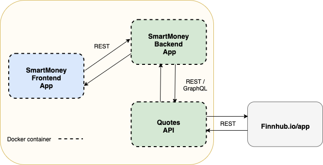

# SmartMoney
This project has both an educational and practical purposes. The goal is to create a useful app that will allow the monitoring value of assets.
The technological stack will be chosen in such a way, so I can learn a few interesting things. 
In the first step, the idea is to create a web application with a reusable backend which can be also used by mobile apps in the future. 

